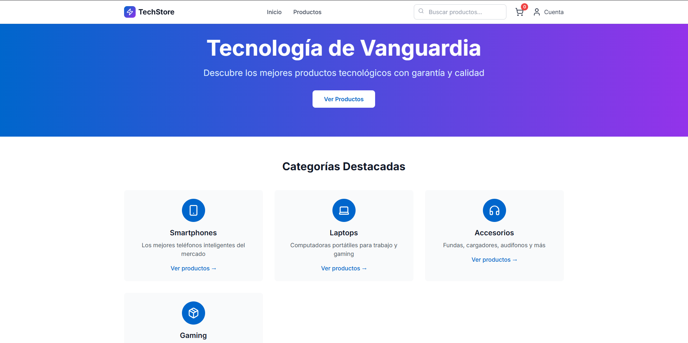
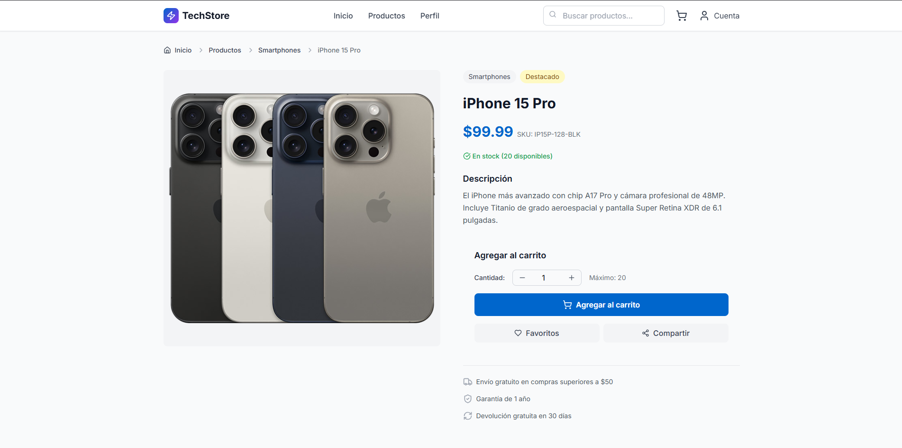
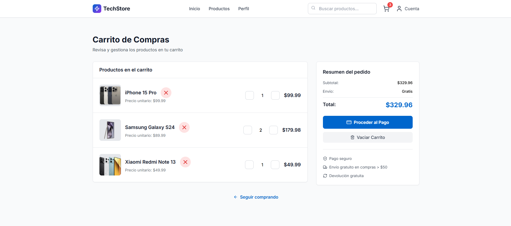
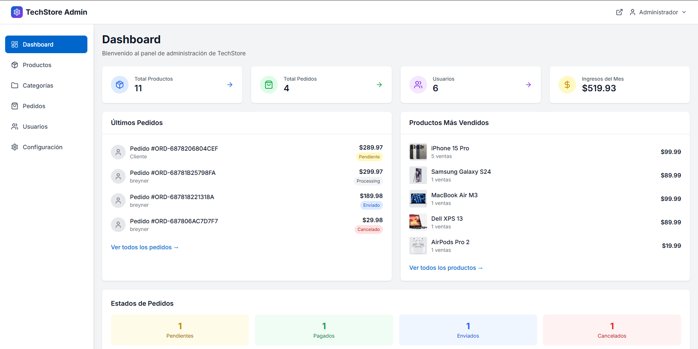

  

<h1 align="center">TechStore</h1>

Tienda virtual desarrollada en Laravel para la gestión de productos, categorías y pedidos.

---

## 🚀 Descripción

**TechStore** es una aplicación web de e-commerce desarrollada como proyecto personal para demostrar habilidades en desarrollo full stack con Laravel.  
El sistema permite a los usuarios explorar un catálogo de productos, agregarlos al carrito y realizar compras, mientras que los administradores pueden gestionar productos, categorías y órdenes desde un panel dedicado.

El proyecto fue realizado con fines de aprendizaje y portafolio, y está pensado para ser presentado en entrevistas o procesos de selección, mostrando tanto la lógica de negocio como la interfaz de usuario y la gestión administrativa.

---

## 🛠️ Características principales

- Registro y autenticación de usuarios
- Navegación y búsqueda de productos por categorías
- Carrito de compras y proceso de checkout
- Panel de usuario con historial de pedidos
- Panel de administración para:
  - Gestión de productos (crear, editar, eliminar, imágenes)
  - Gestión de categorías
  - Gestión de órdenes y visualización de pedidos
- Estadísticas rápidas para administradores
- Interfaz moderna y responsiva con Tailwind CSS

---

## 🧰 Tecnologías usadas

- **Laravel 10** (framework backend)
- **PHP 8**
- **MySQL** (base de datos, gestionada con XAMPP)
- **Tailwind CSS** (estilos)
- **Visual Studio Code** (editor de desarrollo)
- **XAMPP** (servidor local y gestor de base de datos)

---

📸 Capturas de pantalla

 
Página principal: vista de inicio con navegación y Categorias disponibles .
  

 
Listado de productos: catálogo con filtros y categorías.
  

 
Detalle de producto: información, imágenes y opción de agregar al carrito.
  

 
Carrito de compras: productos seleccionados, cantidades y total.
  

 
Checkout: formulario de compra y Solicitud del pedido (PayPal).
  

 
Panel de administración: gestión de productos, categorías y pedidos.

---

## 👤 Autor

- [Breyner Stiven Guarin Arias](https://github.com/BreynerSti)

---
